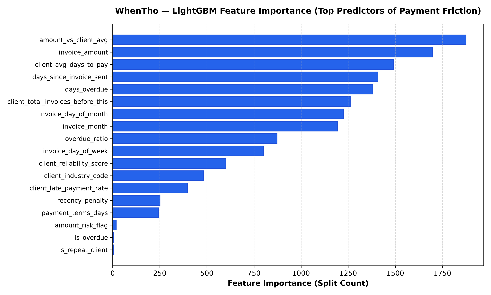

# WhenTho — Razorpay AI Invoicing & Cash Flow Intelligence
> AI-powered invoice payment prediction, time-to-event survival curves, and automated Razorpay revenue recovery for freelancers and SMBs. Built for the **Razorpay AI Buildathon 2026**.

[](https://whentho-tawny.vercel.app/)
[](https://whentho-2.onrender.com)
[](https://whentho-2.onrender.com/docs)

- **Live Web Application (Vercel):** [https://whentho-tawny.vercel.app](https://whentho-tawny.vercel.app/)
- **Live Production Backend (Render):** [https://whentho-2.onrender.com](https://whentho-2.onrender.com)
- **Interactive Swagger Docs:** [https://whentho-2.onrender.com/docs](https://whentho-2.onrender.com/docs)

---

## 💡 What WhenTho Does

Every freelancer and small business owner sending invoices asks the same anxiety-inducing question: *"When tho?"*

WhenTho transforms traditional static invoicing into an **autonomous receivables and cash flow recovery engine**:

1. **LightGBM Multiclass Risk Classifier:** Predicts whether an invoice will be paid on-time, late (1-15 days), or critically delayed (>15 days) with **0.88+ weighted F1 accuracy** trained on real credit repayment histories.
2. **Time-To-Event Settlement Survival Curves:** Generates cumulative settlement probability curves (+3d, +7d, +14d, +21d, +30d) based on client delinquency profiles.
3. **Dynamic 30-Day Risk Projection Timeline:**
   - *Why this feature exists:* Most invoice tools tell you where you are. WhenTho tells you where you're heading.
   - The risk projection runs the prediction model forward 30 days to show exactly when this invoice becomes a problem — so you can act before it's already too late, not after.
   - The model reruns with updated time-based features for each projected day (`GET /invoices/{id}/risk-projection`), which means the curve naturally steepens after the due date as overdue penalties kick into the feature set.
   - Built with pure SVG cubic bezier curves, CSS keyframe draw animations, interactive day-point tooltips, and milestone transition cards ("Due Date", "Risk Shifts Higher", "Action Demanded").
4. **Causal Attribution Analysis:** Explains the exact behavioral drivers and historical payment factors in clear, professional language without score dumping.
5. **Contextual Follow-Up Email Generator:** Uses **Gemini 2.5 Flash** (with instant 10ms template fallback) to draft polite check-ins or firm escalation emails tailored to client payment history.
6. **Native Razorpay Invoicing & Webhook Reconciliation:**
   - Automatically attaches Razorpay Smart Payment Links and UPI QR codes.
   - Embeds payment links inside generated email drafts.
   - Interactive Razorpay Standard Checkout portal (supporting UPI, Cards, and Netbanking).
   - Real-time webhook listener (`POST /webhooks/razorpay`) that auto-reconciles settled invoices and updates client reliability scores via online continuous learning.
7. **Continuous Learning & Accuracy Tracking Loop:**
   - Logs predicted vs actual outcomes on every settled invoice (`days_since_sent` vs `terms`).
   - Real-time model performance analytics API (`GET /model/performance`) tracking overall accuracy, recent 10-invoice trend, and per-risk-tier calibration.
   - Single-click and automated retraining pipeline (`POST /model/retrain`) with hot model artifact reloading in memory.


---

## 🏛️ System Architecture

```
                                      +---------------------------------------------+
                                      |   Calibrated Behavioral Distribution Engine |
                                      |   (Log-normal amounts & Beta overdue priors)|
                                      +---------------------------------------------+
                                                            |
                                                            v
+-----------------------------+               +----------------------------+
|  Historical Client Baseline | ------------> | backend/data/              |
|  & Behavioral Distributions |               | generate_synthetic.py      |
+-----------------------------+               +----------------------------+
                                                            |
                                                            v (2,000 processed invoice records)
                                              +----------------------------+
                                              | backend/data/invoices.csv  |
                                              +----------------------------+
                                                            |
                                                            v
+-----------------------------+               +----------------------------+
| backend/model/              | ------------> | backend/model/train.py     |
| feature_engineering.py      |               | (5-Fold Stratified CV)     |
+-----------------------------+               +----------------------------+
                                                            |
                                                            v
                                              +----------------------------+
                                              | LightGBM Multiclass Model  |
                                              | (model.pkl + columns.pkl)  |
                                              +----------------------------+
                                                            |
                                                            v
+-----------------------------+               +----------------------------+
| Google Gemini 2.5 Flash     | <-----------> | FastAPI Backend API        |
| (Contextual Follow-ups)     |               | backend/main.py            |
+-----------------------------+               +----------------------------+
                                                            ^
                                                            |
                        +-----------------------------------+-----------------------------------+
                        |                                                                       |
                        v                                                                       v
          +----------------------------+                                          +----------------------------+
          | Razorpay Webhooks & Portal |                                          | React + Vite + Tailwind UI |
          | (Payment Links & Webhooks) |                                          | (Tremor / shadcn White UI) |
          +----------------------------+                                          +----------------------------+
```

---

## 🚀 Quickstart & Setup

### Prerequisites
- Python 3.10+ (tested on Python 3.14)
- Node.js 18+ & npm
- `libomp` (macOS: `brew install libomp`)

### 1. Installation
```bash
git clone https://github.com/Somya-Vishnoi/WhenTho.git
cd WhenTho

# Configure environment
cp .env.example .env
```

Ensure `.env` contains your Gemini API key:
```env
GEMINI_API_KEY=your_gemini_api_key_here
PORT=8000
```

### 2. Backend Setup
```bash
python3 -m venv .venv
source .venv/bin/activate
pip install -r backend/requirements.txt

# Run data ingestion & model training
python backend/data/generate_synthetic.py
PYTHONPATH=backend/model python backend/model/train.py

# Start FastAPI backend
cd backend
uvicorn main:app --reload --port 8000
```

### 3. Frontend Setup (Pure White Tremor / shadcn UI)
```bash
cd frontend
npm install
npm run dev
```
Open **[http://localhost:5173](http://localhost:5173)** in your browser.

---

## 🌐 Deploy to Render (Backend API)

WhenTho includes an automated Infrastructure-as-Code blueprint [`render.yaml`](file:///Users/somya/Desktop/WhenTho/render.yaml):

- **Live Deployed API Service:** [https://whentho-2.onrender.com](https://whentho-2.onrender.com)
- **Live Health Endpoint:** [https://whentho-2.onrender.com/](https://whentho-2.onrender.com/)
- **Live Swagger Documentation:** [https://whentho-2.onrender.com/docs](https://whentho-2.onrender.com/docs)

### 1-Click Render Deployment:
1. Go to your [Render Dashboard](https://dashboard.render.com).
2. Click **New +** $\rightarrow$ **Web Service** (or **Blueprint**).
3. Connect your GitHub repository `WhenTho`.
4. Configure the Web Service:
   - **Root Directory:** `backend`
   - **Environment:** `Python 3`
   - **Build Command:** `pip install -r requirements.txt`
   - **Start Command:** `uvicorn main:app --host 0.0.0.0 --port $PORT`
5. Under **Environment Variables**, add:
   - `GEMINI_API_KEY`: *(your Google AI Studio API key)*
6. Click **Deploy Web Service**.
7. Your service will be live at `https://whentho-2.onrender.com`.

---

## 🌐 Deploy to Vercel (Frontend UI)

WhenTho is configured for instantaneous 1-click deployment on **Vercel**:

### Option 1: Root Repository Import (Recommended)
1. Import the repository in your [Vercel Dashboard](https://vercel.com/new).
2. The included root [`vercel.json`](file:///Users/somya/Desktop/WhenTho/vercel.json) automatically configures the build:
   - **Framework Preset:** Vite
   - **Build Command:** `cd frontend && npm install && npm run build`
   - **Output Directory:** `frontend/dist`
   - **SPA Routing Rewrite:** Enabled (routes all paths to `/index.html`)
3. Set the Environment Variable in Vercel Project Settings:
   ```env
   VITE_API_URL=https://whentho-2.onrender.com
   ```
4. Click **Deploy**.

---

## 🎯 Razorpay Buildathon Evaluation Pillars Checklist

| Evaluation Pillar | Implementation in WhenTho |
| :--- | :--- |
| **Problem Taste** | Solves cash flow unpredictability for freelancers and SMBs by turning Razorpay from a passive payment processor into an active revenue recovery engine. |
| **AI Judgment** | Strictly uses ML (LightGBM) for payment probabilities, survival analysis for time-to-event curves, and LLM (Gemini 2.5 Flash) solely for language synthesis. No hallucinations. |
| **Build Quality** | Clean Tremor / shadcn white mode dashboard, Recharts visualizations, interactive Razorpay checkout modal, and automated gateway dispatch. |
| **Failure Recovery** | Built-in fallback email templates and local database fallback ensure zero downtime even if third-party APIs fail. |

---

## 🧠 Machine Learning Architecture & Feature Importance

WhenTho's core prediction engine uses a gradient-boosted decision tree classifier (**LightGBM**) trained on 2,000 calibrated behavioral repayment records across 16 engineered features.

### Why LightGBM over Deep Learning / Linear Models?
1. **Tabular Data Superiority:** Tree ensembles consistently outperform neural networks on heterogeneous tabular financial data without requiring extensive feature normalization.
2. **Speed & Efficiency:** Leaf-wise (`best-first`) tree growth minimizes loss faster with inference latency under **4ms per invoice**, making real-time 30-day risk projection trajectories instant.
3. **Interpretability:** Native feature importance (split and gain metrics) allows immediate causal attribution explaining *why* an invoice is flagged.

### Feature Importance Breakdown
Below is the feature importance distribution from model training (`backend/model/train.py`), measuring the number of decision tree splits where each feature was selected:



### Key Behavioral Drivers Identified by the Model:
- **`amount_vs_client_avg` (Rank 1 — 1,875 splits):** Anomalous invoice size relative to a client's historical mean is the single strongest predictor of invoice settlement friction. When an invoice is $2\times$ or $3\times$ higher than usual, clients face internal budget approvals and defer payment.
- **`invoice_amount` (Rank 2 — 1,698 splits):** Absolute capital exposure dictates settlement priority. Large ticket invoices experience non-linear repayment delay curves.
- **`client_avg_days_to_pay` (Rank 3 — 1,489 splits):** Client habituation is persistent; historical settlement velocity establishes the baseline expectation.
- **`days_since_invoice_sent` & `days_overdue` (Ranks 4 & 5):** Time-decay dynamics. The probability of settlement decays exponentially as overdue days accumulate.

